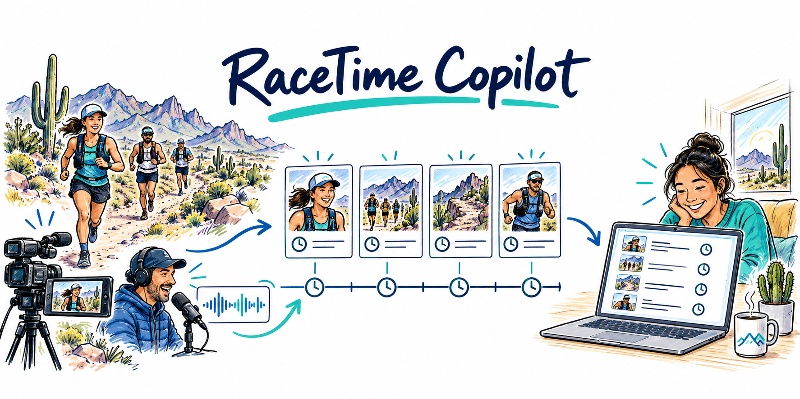

# RaceTime Copilot

> Catch up on a missed race interval with timestamped evidence and no future spoilers.

Built by Siva Babu, an ultramarathoner and race organizer, for an agentic AI capstone.



## The problem

You miss 15 minutes of a long race broadcast. Finding the important moments means scrubbing through video, checking runner names and reconciling conflicting commentary and timing graphics.

RaceTime lets you choose an interval, ask what happened, and inspect the source observations behind the recap.

**Two workspaces:** the video product connects Gemini to public YouTube URLs or uploaded videos; the evidence demo works without a key using fictional race observations. See [implementation and validation status](docs/product-status.md).

## Quick start

Requires Python 3.11+ for the video workspace.

```bash
python3 -m venv .venv
source .venv/bin/activate
pip install -r requirements.txt
python scripts/run_product.py
```

Open **http://localhost:8501**. Configure Gemini, sign in, save a video and queue an interval question. [API key and account setup](docs/setup.md). The worker continues processing while you use the app; review results under Jobs / results.

To include the original evidence demo, also run `npm ci` and use `python scripts/run_demo.py`. It requires Node.js 22.13+ and no Gemini key.

## How to use

1. Open **Video workspace** and create an account or sign in.
2. In **Videos**, paste a public YouTube video or livestream URL and click **Save video**. A short MP4 upload also works.
3. For a recorded video, choose **Ask / inspect → Ask the agent**. Set Start `10:00`, End `15:00` and Spoiler cutoff `15:00`.
4. Ask: **“What happened between 10:00 and 15:00? Summarize the key moments.”** The time fields control the interval, even when your question includes times.
5. Click **Queue job**, then **Jobs / results → Refresh jobs**. Read the recap, follow its timestamps, and approve or reject after checking the source.

For a livestream, first use **Capture a live stream** with the current elapsed broadcast time. Once segments are processed, ask about a captured interval or select **Use the last 15 minutes of processed live coverage**. Earlier uncaptured footage is unavailable.

**Expected result:** a short answer with evidence timestamps, missing-footage notices and a saved review. If there is not enough evidence or the provider cannot process the video, the app says so.

**Behind the scenes:** check your request → queue work → retrieve or inspect footage → select relevant notes → write and check the recap → wait for your review.

[Simple guide: prompt examples, sample output and each background step](docs/how-to-use.md). The same guide is available in the app's **How to use** panel. See [current validation limits](docs/product-status.md) if a video fails.

## Try one scenario

In the optional **Evidence demo**, choose **Canyon Relay**, enter `00:00` to `15:00`, set the cutoff to `15:00`, and ask **What happened?**

Two ridge reports disagree. RaceTime shows both, flags the conflict, and excludes the later timing update. Inspect the trace, approve or reject the recap, and export it.

| Scenario | What to look for |
|---|---|
| Missed interval | Only observations fully inside your time range |
| Conflicting reports | Both claims shown; no invented winner |
| Missing evidence | An explicit insufficient-evidence response |
| Retrieval failure | One retry, recorded in the trace |
| Live evidence update | Appended observations create a new source revision |

## How it works

```text
Video → bounded inspection → semantic retrieval → cited recap → durable human review
```

The video workspace uses a bounded Gemini planner, semantic retrieval, cited summaries, SQLite jobs and a durable LangGraph review checkpoint. Continuous live capture processes completed segments with explicit coverage. The original TypeScript evidence demo remains available with its D1 store and weighted LRU.

## Architecture

Two technical views show the running components and the decisions behind a recap. Blue marks application rules, amber model operations, green human review and red blocked or unverified paths.


Open the [system diagram](public/architecture/racetime-system-architecture.svg) or [decision flow](public/architecture/racetime-decision-flow.svg) to zoom in. Both are also in Streamlit's collapsed **Technical architecture** panel. [Architecture details and validation limits](docs/architecture.md).

## Check it

```bash
python -m unittest discover -s tests -p product_test.py
npm test                     # original 17 unit tests
npm run eval                 # 40 synthetic evidence cases
python tests/streamlit_smoke.py  # with the local demo running
```

The evidence workflow passed **40/40** synthetic cases versus **20/40** for the naive baseline. A separate LoRA routing experiment scored **70%** versus **52.5%** for its baseline. These results do not establish real-video quality; the trained router is not used in the app.

## Read next

| Document | Purpose |
|---|---|
| [Six-page brochure](docs/RaceTime-Copilot-Brochure.pdf) | Problem, audience, workflow, technology, results and next steps |
| [How to use](docs/how-to-use.md) | Links, time ranges, prompt examples, expected output and background steps |
| [Learning guide](docs/learning-guide.md) | What the main files do and where to start |
| [Demo guide](docs/demo-guide.md) | Five-minute walkthrough and import examples |
| [Week 1–5 explained](docs/capstone-learning.md) | Learning, product application, demo evidence and remaining gaps for each week |
| [Week 1–5 map](docs/technology-map.md) | What is implemented and what remains |
| [Architecture](docs/architecture.md) | Time rules, storage and operating limits |

Public deployment configuration is included, but a host, domain and OIDC credentials are required. Real-video quality needs human-reviewed cases. See [setup](docs/setup.md) and [status](docs/product-status.md) before treating the product as validated.
