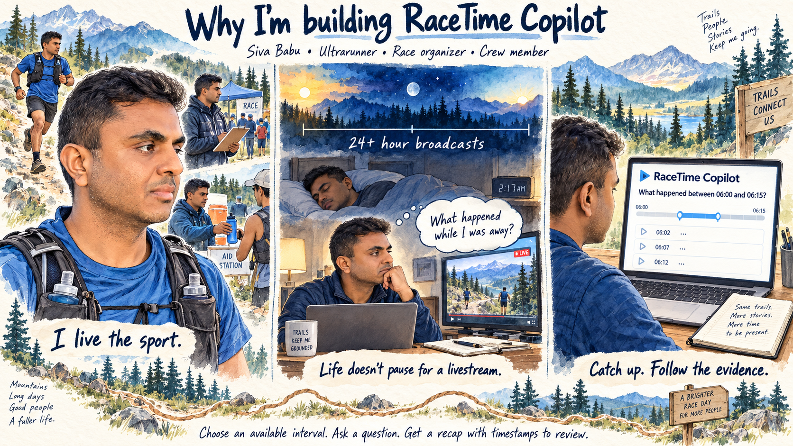
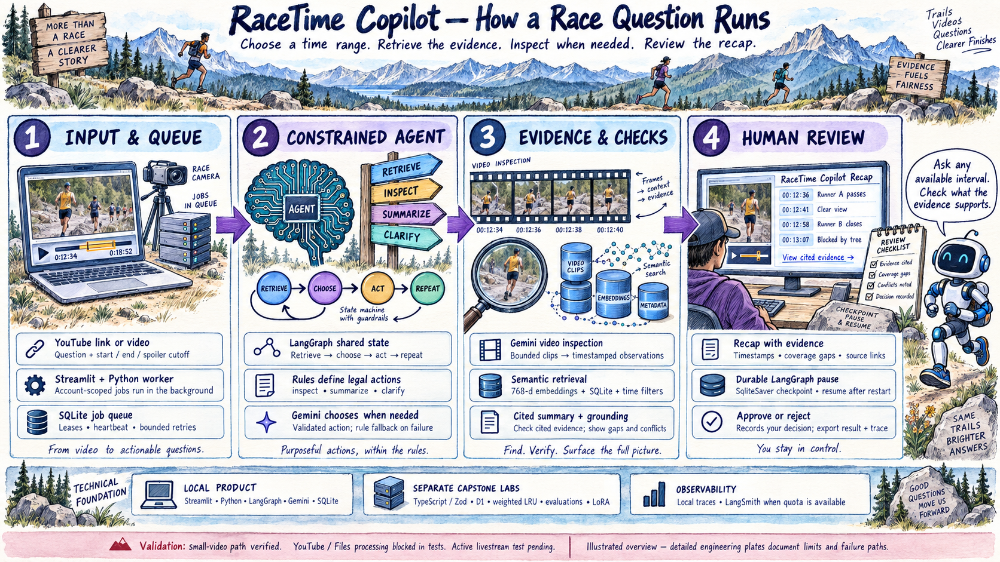
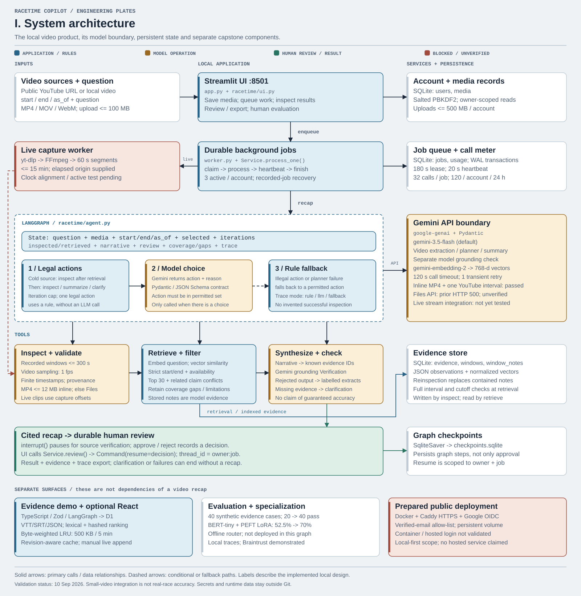
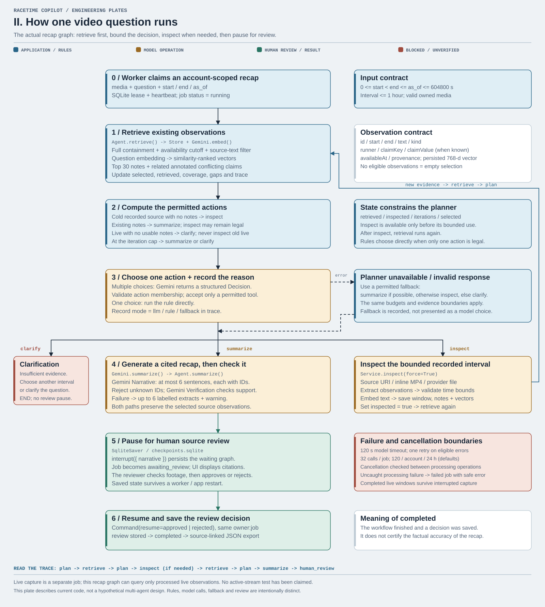
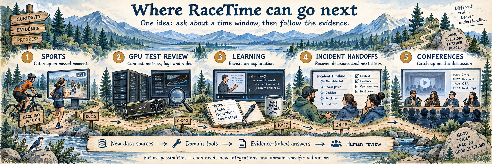

# RaceTime Copilot

> Catch up on a missed race interval with timestamped evidence and no future spoilers.

## Why I’m building this



I’m an ultrarunner, race organizer and crew member, and I follow ultra athletes closely. The races I follow can be livestreamed for more than 24 hours. I want to follow the whole story, but I also need to sleep and work.

When I step away, part of my mind stays with the race: **What happened while I was away? How are the athletes I’m following doing? Which moments did I miss?** Coming back often means scrubbing through hours of footage to piece the story together. That is why I’m building RaceTime Copilot.

I want to stay connected to the sport and the people I care about, while being present for the rest of my life. [Read my story and what the product does](docs/founder-story.md). The artwork uses my likeness; the scenes and app screen are illustrative.

## What RaceTime does

Add a YouTube link or video, choose an available interval, and ask **“What happened between 06:00 and 06:15?”** Set the same times in the app. RaceTime retrieves observations or inspects the footage when needed, then produces a recap with timestamped evidence to review. It applies time and spoiler boundaries and shows gaps or uncertainty when evidence is incomplete.

It is being built for fans catching up, crews following athletes and organizers reviewing race moments. Live questions use captured coverage; a link does not automatically record an entire 24-hour broadcast.

**Two workspaces:** the video product connects Gemini to public YouTube URLs or uploaded videos; the evidence demo works without a key using fictional race observations. See [implementation and validation status](docs/product-status.md).

## Beyond ultra races

The same idea—ask about a time window and review the evidence—could extend to these five uses. **These are proposed extensions, not completed features.**

| Priority | Use case | What it helps people do | Main addition needed |
|---|---|---|---|
| 1 | Other endurance sports and long tournaments | Catch up on missed race or match moments | Sport-specific events, rosters and timing feeds |
| 2 | GPU benchmark and factory test review | Investigate what changed around a performance drop | Time-aligned benchmark metrics, logs and numerical tools |
| 3 | Lectures, training and technical demos | Revisit an explanation with its original demonstration | Transcripts, slide/code extraction and course context |
| 4 | Incident review and shift handoffs | Recover decisions, attempted fixes and unresolved issues | Incident records, action tracking and team access |
| 5 | Conferences, panels and public meetings | Catch up on discussion, agreement and disagreement | Speaker-labelled transcripts, agendas and attribution checks |

**Closest next step:** another endurance sport. **Strongest professional extension:** GPU benchmark review, bringing performance metrics, test logs and video into one evidence timeline. [Examples, required changes and validation for all five](docs/future-use-cases.md). The same section appears in Streamlit under **Beyond ultra races**.

## Quick start

Requires Python 3.11+ for the video workspace.

```bash
python3 -m venv .venv
source .venv/bin/activate
pip install -r requirements.txt
python scripts/run_product.py
```

Open **http://localhost:8501**. Configure Gemini, sign in, save a video and queue an interval question. [API key and account setup](docs/setup.md). The worker continues processing while you use the app; review results under Jobs / results.

To include the original evidence demo, also run `npm ci` and use `python scripts/run_demo.py`. It requires Node.js 22.13+ and no Gemini key.

## How to use

1. Open **Video workspace** and create an account or sign in.
2. In **Videos**, paste a public YouTube video or livestream URL and click **Save video**. A short MP4 upload also works.
3. For a recorded video, choose **Ask / inspect → Ask the agent**. Set Start `10:00`, End `15:00` and Spoiler cutoff `15:00`.
4. Ask: **“What happened between 10:00 and 15:00? Summarize the key moments.”** The time fields control the interval, even when your question includes times.
5. Click **Queue job**, then **Jobs / results → Refresh jobs**. Read the recap, follow its timestamps, and approve or reject after checking the source.

For a livestream, first use **Capture a live stream** with the current elapsed broadcast time. Once segments are processed, ask about a captured interval or select **Use the last 15 minutes of processed live coverage**. Earlier uncaptured footage is unavailable.

**Expected result:** a short answer with evidence timestamps, missing-footage notices and a saved review. If there is not enough evidence or the provider cannot process the video, the app says so.

**Behind the scenes:** check your request → queue work → retrieve or inspect footage → select relevant notes → write and check the recap → wait for your review.

[Simple guide: prompt examples, sample output and each background step](docs/how-to-use.md). The same guide is available in the app's **How to use** panel. See [current validation limits](docs/product-status.md) if a video fails.

## Try one scenario

Need question ideas? Browse [100 useful YouTube questions and scenarios](docs/youtube-question-library.md): 20 for the tested race-briefing interval and 80 for athlete tracking, crew handoffs, course updates, replay moments and more. Each includes the intended response. All are authored suggestions awaiting testing. The same library appears in Streamlit, grouped by category.

In the optional **Evidence demo**, choose **Canyon Relay**, enter `00:00` to `15:00`, set the cutoff to `15:00`, and ask **What happened?**

Two ridge reports disagree. RaceTime shows both, flags the conflict, and excludes the later timing update. Inspect the trace, approve or reject the recap, and export it.

| Scenario | What to look for |
|---|---|
| Missed interval | Only observations fully inside your time range |
| Conflicting reports | Both claims shown; no invented winner |
| Missing evidence | An explicit insufficient-evidence response |
| Retrieval failure | One retry, recorded in the trace |
| Live evidence update | Appended observations create a new source revision |

## How it works

```text
Video → bounded inspection → semantic retrieval → cited recap → durable human review
```

The video workspace uses a bounded Gemini planner, semantic retrieval, cited summaries, SQLite jobs and a durable LangGraph review checkpoint. Continuous live capture processes completed segments with explicit coverage. The original TypeScript evidence demo remains available with its D1 store and weighted LRU.

## Architecture



Follow a race question through this illustrated overview. The example race events are illustrative. [Open the full-size image](public/architecture/racetime-illustrated-architecture.png).

Two technical views show the running components and the decisions behind a recap. Blue marks application rules, amber model operations, green human review and red blocked or unverified paths.





Open the [system diagram](public/architecture/racetime-system-architecture.svg) or [decision flow](public/architecture/racetime-decision-flow.svg) to zoom in. Both are also in Streamlit's collapsed **Technical architecture** panel. [Architecture details and validation limits](docs/architecture.md).

## Check it

For Python changes, follow the [coding standard and formatting commands](CONTRIBUTING.md). Ruff formatting and lint are checked by GitHub Actions.

**Recorded YouTube test (10 September 2026):** a direct link worked for **05:00–08:00**, producing seven observations and a cited recap without an upload. Human factual review is pending. [Read the result, timestamps, trace and reproduction steps](reports/youtube-interval-test.md). The saved report is also available in Streamlit’s **Recorded YouTube test** panel.

See [Evals and observability](evals-observability/README.md) for frozen golden datasets, per-case benchmarks, baseline comparisons, trace examples and a five-minute demonstration.

```bash
python -m unittest discover -s tests -p product_test.py
npm test                     # original 17 unit tests
npm run eval                 # 40 synthetic evidence cases
npm run eval:benchmark       # frozen golden cases + observable retry/cache checks
python tests/streamlit_smoke.py  # with the local demo running
```

The evidence workflow passed **40/40** synthetic cases versus **20/40** for the naive baseline. A separate LoRA routing experiment scored **70%** versus **52.5%** for its baseline. These results do not establish real-video quality; the trained router is not used in the app.

## Read next

| Document | Purpose |
|---|---|
| [Six-page brochure](docs/RaceTime-Copilot-Brochure.pdf) | Problem, audience, workflow, technology, results and next steps |
| [How to use](docs/how-to-use.md) | Links, time ranges, prompt examples, expected output and background steps |
| [Learning guide](docs/learning-guide.md) | What the main files do and where to start |
| [Demo guide](docs/demo-guide.md) | Five-minute walkthrough and import examples |
| [Week 1–5 explained](docs/capstone-learning.md) | Learning, product application, demo evidence and remaining gaps for each week |
| [Week 1–5 map](docs/technology-map.md) | What is implemented and what remains |
| [Architecture](docs/architecture.md) | Time rules, storage and operating limits |

Public deployment configuration is included, but a host, domain and OIDC credentials are required. Real-video quality needs human-reviewed cases. See [setup](docs/setup.md) and [status](docs/product-status.md) before treating the product as validated.

---

## Where RaceTime can go next



**New data sources → Domain tools → Evidence-linked answers → Human review.** Each extension would reuse the time-window workflow and add its own integrations and validation.

*Future possibilities, not completed features. The scenes and sample screens are illustrative.* [Explore all five use cases](docs/future-use-cases.md) · [Open the full-size illustration](public/art/expansion-footer.png).
