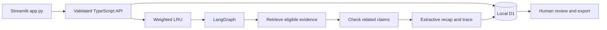

# Architecture

The launcher starts Streamlit on port 8501 and reuses or starts the backend on port 3000. The optional React interface uses the same API.

## Time rules

Times are seconds from video start. A complete observation must fit inside the requested interval, end at or before the spoiler cutoff, and have become available by that cutoff. Partial cues are excluded. Declared coverage can still contain gaps.

Live append adds observations with unique IDs and the current revision. A successful update advances the revision and makes previous cache keys obsolete. Automatic live polling is not implemented.

## Evidence rules

Ranking combines lexical matches with deterministic hashed vectors. These are not learned semantic embeddings. Conflicts require explicit `claimKey` and `claimValue` annotations; the app does not discover every disagreement in arbitrary prose. A related conflicting claim can be included even when it concerns another runner, but must still satisfy the time rules.

The workflow has one bounded retry. A simple pattern filter excludes obvious source instructions; it is not a complete security classifier. No imported text is executed or sent to an LLM in this build.

## Storage and review

Local D1 stores sources and runs. A random session cookie scopes each workspace. Streamlit retains it in a per-user Python session across reruns; a full refresh or restart may lose access to that session. React and Streamlit use separate sessions. Production accounts and recovery are not implemented.

The cache allows 500 KB of serialized result bytes and a five-minute lifetime. Keys include the source revision and full question. A reused result gets a new run ID and pending review. The app retains 100 runs per session and shows the latest 20.

Approval records a decision on a completed recap. It is not a durable LangGraph pause/resume operation.

## Next integration

Gemini would produce timestamped observations before ingestion. Validate those observations and test them against human-reviewed video intervals before adding automatic livestream analysis. Local traces work now; external LangSmith traces and public hosting have not been verified.
