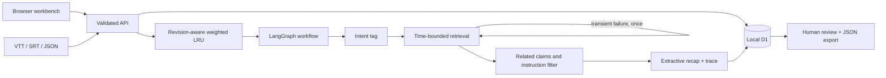

# Architecture and operating limits

## Evidence contract

Times are elapsed seconds from the video start, not wall-clock race time. Imported cues are the retrieval chunks. A finding must be fully inside `[start, end]`, end before/equal `asOf`, and have `availableAt <= asOf`. A missing `availableAt` defaults to the cue end. Partial cues are excluded rather than trimmed or paraphrased without evidence.

Coverage is the declared imported range. It does not mean every moment has an observation. A live source's `availableEnd` can advance through an append; automatic polling and moving DVR eviction are not implemented. Updates must preserve unique evidence IDs and match the current revision. The D1 batch conditionally inserts observations and increments revision in one transaction.

Related claims can bring another runner's contradictory evidence into a runner-filtered recap. The conflicting claim must still fit the exact time boundaries. Conflict detection requires explicit `claimKey` / `claimValue` annotations; it does not infer contradictions from arbitrary prose. Earlier conflicts are retained, even when a later report appears; there is no automated truth-resolution rule.

The rule router records a coarse intent tag. It does not launch separate autonomous agents or implement two-window comparison. The current query supports one interval; cross-interval comparison is a future product extension. No learned model generates the recap.

## Cache and persistence

The process-local LRU weighs serialized UTF-8 result bytes, has a default 500 KB budget and five-minute TTL, returns copies, and includes source ID, source revision and the entire query in its key. A cache hit receives a new run ID and pending review. Imports and run decisions persist in D1. The last 100 runs are retained per session and 20 shown in the UI.

An HttpOnly SameSite=Strict cookie supplies a random browser-session identifier. SQL queries scope imported sources and runs by that identifier. The public demo is shared immutable data. Clearing the cookie loses access from that browser; account recovery, administration, retention policies and production login are not implemented. Do not expose this prototype as a multi-tenant production service.

## Observability

Every recap has a run ID, source revision, timestamps, mode, cache flag, latency, warnings and trace stages. Local reports retain per-case expected/actual evidence. For optional LangSmith traces while running the Node evaluator, set `LANGSMITH_TRACING=true`, `LANGSMITH_API_KEY` and `LANGSMITH_PROJECT` in the shell and run `npm run eval`. The LangGraph invocation supplies tags and source/revision metadata. No external trace was sent or verified for this delivery.

The instruction filter is a simple demonstrative pattern check, not a complete security classifier. Imported text is treated as source data and never executed or passed to a model in this build. A future model integration needs stronger input isolation and adversarial evaluation.

## Future Gemini connection

Insert a provider adapter before ingestion: validate a public YouTube URL, request a bounded video window, obtain structured observations with timestamps, validate them, and store them under explicit model provenance. Do not reinterpret a failed provider request as a successful recap. Test timestamp offsets, nonvisible identities, stale timing graphics and missing coverage against reviewed video intervals before enabling live use.

No provider key is stored in client code. `.env*`, `.dev.vars`, local databases, caches and model base weights are excluded from Git. Hosting registration was attempted once and returned an account usage limit; no live deployment URL is claimed.
