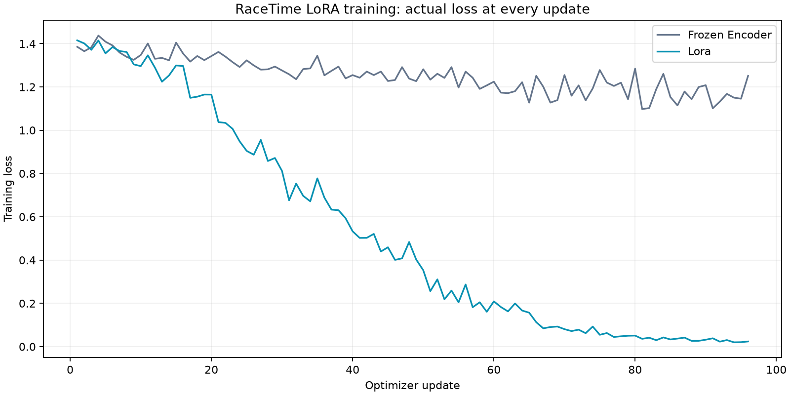

# Week 5 demonstration: a specialized race-question router

The Week 5 handout teaches a focused LoRA router: labeled data → train an adapter → inspect loss → merge → smoke-test → compare with a baseline. RaceTime follows the permitted **custom-project path** with a small local encoder classifier. It does not claim to have run the handout's Qwen3-1.7B / LLaMA Board support-ticket notebook.

| Requirement | What is demonstrated | Evidence |
|---|---|---|
| Labeled task and held-out data | Four intents: recap, runner, verify, compare; 144 authored training examples and 40 separately worded held-out examples | [Frozen dataset](../evals-observability/datasets/router-v1.json) |
| LoRA training choices | BERT-tiny; rank 8, alpha 16, dropout 0.05, query/value adapters, classifier head; learning rate 0.002, batch 24, 16 epochs | [Training code](../training/train_router.py) |
| Training behavior | All 96 per-update loss values saved for both trained arms; chart shows actual values, including fluctuations | [Loss curve](../reports/week5-training-curve.png), [full report](../reports/router-evaluation.json) |
| Merge and smoke-test | Adapter and merged logits agree within 1e-5; five obvious examples route correctly | [Merge report](../reports/router-smoke.json), [merge code](../training/infer.py) |
| Baseline comparison | Untrained head: 27.5%; trained head/frozen encoder: 52.5%; LoRA: 70%. Full per-class metrics, confusion matrices and held-out predictions are retained | [Results](../reports/router-evaluation.json) |
| Demonstrate inference | Streamlit's Week 5 expander runs the merged model locally on a new question and shows the route | [Inference-only implementation](../training/predict.py), [demo panel](../demo/specialization.py) |
| Explain substitutions and errors | The classifier replaces support-ticket categories with race intents. It still misroutes 12/40 held-out requests | This guide and the error table in Streamlit |
| Package the custom submission | GitHub includes data, code, adapter and measured results. A completed [5:00 Safari recording](../reports/safari-demo.md) demonstrates the workflow; the handout names Loom, so acceptance of a different video link is unconfirmed | [Training assets](../training), [adapter](../model/adapter) |



The untrained-head arm has a seeded random classification head; its score is not a frontier-model or generative zero-shot baseline. The frozen-encoder/head-trained comparison is the stronger control for the contribution of the adapter. Both trained arms use the same examples, initialization and optimizer schedule. None of the 40 held-out labels are used in gradient updates, but this familiar split has been inspected before; it is not a newly blind benchmark.

LoRA improves this measured classification task, not video understanding. The classifier remains a separate lab and does not change the production agent's decisions. No production speed, dollar savings, or independent real-user accuracy is established. Displayed warm inference time excludes model loading and must not be compared directly with an end-to-end video job.

## Reproduce and demonstrate

```bash
python training/train_router.py
python training/infer.py
python training/plot_losses.py
```

Install `training/requirements-lock.txt` first. The plot uses recorded per-step losses. `training/predict.py` loads only the merged local artifact and does not retrain or rewrite model files.

In Streamlit, open **Week 5 demonstration: LoRA training, results and live router**. Show the comparison table, loss curve, five smoke examples, the held-out error table, then classify “Compare those two race sections.” The softmax score is not calibrated confidence.

## How Nebius and Braintrust relate

**Nebius supports Week 4:** a different model judges answers against supplied source facts. Its live five-fixture check agreed with 4/5 authored expectations, including one disagreement on a partial answer. These fixtures are not independent human calibration and the negative result remains published.

**Braintrust supports observability:** application spans can show video work, model calls, judge calls and the separate local router demo. This does not train a LoRA model and cannot replace human labels. Parent/retrieval/Nebius hosted delivery is separately [verified](../evals-observability/observability/examples/braintrust-nebius-check.json); this fixture trace does not establish real-video accuracy.

## Submission boundary

The handout permits a GitHub custom project with assets and a Loom video, and says the assignment is optional for the certificate. This project demonstrates the adapted technical workflow. A screen recording is a reviewable demo artifact, but a non-Loom submission is not automatically equivalent to the handout's stated submission format. Instructor acceptance and submission itself are not claimed.
